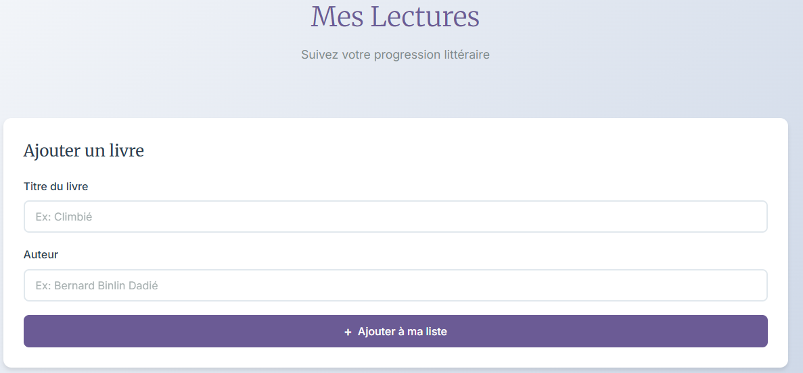
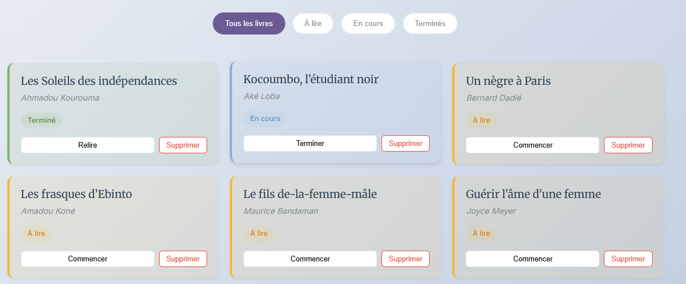

# Reading_Tracking

## Description
Application web permettant de suivre ses lectures en enregistrant des livres et leur statut (à lire, en cours, terminé).  
Ce projet est le **dix-septième** du défi personnel **100 projets en 2026**.

---

## Objectifs du projet
- Mettre en place un CRUD complet
- Gérer des statuts dynamiques
- Manipuler des formulaires
- Utiliser le stockage local
- Concevoir une interface simple et fonctionnelle

---

## Plateforme
- Web (navigateur)

---

## Technologies utilisées
- HTML
- CSS
- JavaScript (Vanilla)
- LocalStorage

---

## Fonctionnalités
- Ajout d’un livre (titre, auteur)
- Attribution d’un statut (à lire / en cours / terminé)
- Liste des livres enregistrés
- Filtrage par statut
- Suppression d’un livre
- Sauvegarde locale des données

---

## Design & UX
- Interface claire et minimaliste
- Carte d’ajout bien structurée
- Indicateurs visuels pour les statuts
- Navigation simple
- Responsive (mobile et desktop)

---

## Captures d’écran

---

## Ce que j’ai appris
- Implémentation d’un CRUD en JavaScript
- Gestion d’état côté client
- Manipulation du DOM
- Organisation des données en tableau d’objets
- Amélioration de l’UX avec filtres

---

## Améliorations possibles
- Ajout d’une note ou avis
- Ajout d’une date de début/fin
- Tri automatique
- Import/export JSON
- Mode sombre

---

## Statut du projet
 **Projet terminé**
